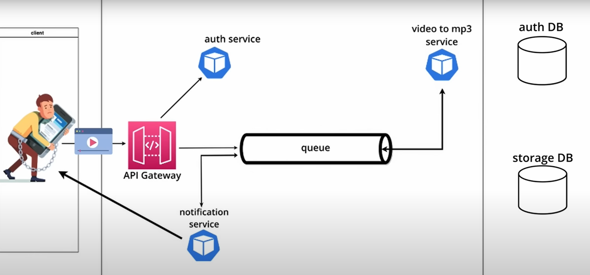

## Microservice Architecture and System Design with Python & Kubernetes
1st recommended
[Microservice Architecture and System Design with Python & Kubernetes – Full Course](https://www.youtube.com/watch?v=hmkF77F9TLw&t=112s)

vary detailed and quality course




### About
* Gateway and auth service is based on [Fastapi](https://fastapi.tiangolo.com/)
* Used rabbitmq for queue service 
* Used dockerized postgresql,redis, rabbitmq and mongodb
* Ratelimiter based on Redis is added on Gateway and Auth service 
* Gateway to Auth sync communication
* Gateway to converter to notifier async communication using rabbitmq
* Oauth2 using bearer token used in the Auth service
* Here we are using only one node {no replicas, you can check menifests and based on your requirement can change the number of replicas, keep in mind for mongo, postgres, redis, rabbitmq number of nodes mustbe exactly one. It is better to keep the number of nodes of gateway exactly one}

### Requirements
* Some knoledge of basic python
* Enable [WSL2](https://learn.microsoft.com/en-us/windows/wsl/install)
* [Docker desktop](https://www.docker.com/products/docker-desktop/), [K9s](https://github.com/derailed/k9s), [minikube](https://minikube.sigs.k8s.io/docs/start), [kubectl](https://kubernetes.io/docs/tasks/tools/) in local system required 
* Windows 8gb ram, and 10gb of space


### Steps to run the service
#### Docker compose based
1. Start the docker desktop 
2. Clone the repo to a local dir 
3. Update the env files
4. Run "docker-compose up -d"
5. For gateway go to [Gateway](http://localhost:8080)
6. For rabbitmq management go to [RabbitMQ](http://localhost:15672)


#### How to set env files values before docker compose ###
** The files will be available inside of the docker-compose directory
```
~~~~~~~~~~~~~~~~~~~~~~~~~~~~~~~~~~~~~~~~~~~~~~~~~~~~~~~~~~~~~~~~~~
auth.env.app
    TITLE=Auth API Oauth2 bearer token based
    VERSION=4.0.1
    HOST=auth-app
    PORT=5000
    SCHEME=http
    DATABASE_HOSTNAME=postgres
    DATABASE_PORT=5432
    DATABASE_PASSWORD=***password of "postgres" service
    DATABASE_NAME=fastapi
    DATABASE_USERNAME=***username of "postgres" service
    SECRET_KEY=***generate from secret library 32 char long 
    ALGORITHM=HS256
    ACCESS_TOKEN_EXPIRE_MINUTES=60
    REFRESH_TOKEN_EXPIRE_HOURS=24
    REDIS_HOST=redis
    REDIS_PORT=6379
~~~~~~~~~~~~~~~~~~~~~~~~~~~~~~~~~~~~~~~~~~~~~~~~~~~~~~~~~~~~~~~~~~
converter.env.app 
    RABBITMQ_HOST=rabbitmq
    RABBITMQ_PORT=5672
    RABBITMQ_USERNAME=***username of "rabbitmq" service
    RABBITMQ_PASSWORD=***password of "rabbitmq" service
    MONGO_USERNAME=***username of "mongo" service
    MONGO_PASSWORD=***password of "mongo" service
    MONGO_HOST=mongo
    MONGO_PORT=27017
~~~~~~~~~~~~~~~~~~~~~~~~~~~~~~~~~~~~~~~~~~~~~~~~~~~~~~~~~~~~~~~~~~
gateway.env.app 
    TITLE=Gateway For Video to Mp3
    VERSION=0.0.1
    MONGO_USERNAME=***username of "mongo" service
    MONGO_PASSWORD=***password of "mongo" service
    MONGO_HOST=mongo
    MONGO_PORT=27017
    RABBITMQ_HOST=rabbitmq
    RABBITMQ_PORT=5672
    RABBITMQ_USERNAME=***username of "rabbitmq" service
    RABBITMQ_PASSWORD=***password of "rabbitmq" service
    AUTH_URI=http://auth-app:5000
    REDIS_HOST=redis
    REDIS_PORT=6379
~~~~~~~~~~~~~~~~~~~~~~~~~~~~~~~~~~~~~~~~~~~~~~~~~~~~~~~~~~~~~~~~~~
notifier.env.app 
    RABBITMQ_HOST=rabbitmq
    RABBITMQ_PORT=5672
    RABBITMQ_USERNAME=***username of "rabbitmq" service
    RABBITMQ_PASSWORD=***password of "rabbitmq" service
    EMAIL_FROM=**registered email id <<go for gmail based>>
    APP_PASSWORD=**app password for this gmail account
~~~~~~~~~~~~~~~~~~~~~~~~~~~~~~~~~~~~~~~~~~~~~~~~~~~~~~~~~~~~~~~~~~
mongo.env.app
    MONGO_INITDB_ROOT_USERNAME=**good username
    MONGO_INITDB_ROOT_PASSWORD=**strong password
~~~~~~~~~~~~~~~~~~~~~~~~~~~~~~~~~~~~~~~~~~~~~~~~~~~~~~~~~~~~~~~~~~
postgres.env.app 
    POSTGRES_USER=**good username
    POSTGRES_PASSWORD=**strong password
    POSTGRES_DB=fastapi
~~~~~~~~~~~~~~~~~~~~~~~~~~~~~~~~~~~~~~~~~~~~~~~~~~~~~~~~~~~~~~~~~~
rabbitmq.env.app 
    RABBITMQ_DEFAULT_USER=**good username
    RABBITMQ_DEFAULT_PASS=**strong password
~~~~~~~~~~~~~~~~~~~~~~~~~~~~~~~~~~~~~~~~~~~~~~~~~~~~~~~~~~~~~~~~~~
redis.env.app
~~~~~~~~~~~~~~~~~~~~~~~~~~~~~~~~~~~~~~~~~~~~~~~~~~~~~~~~~~~~~~~~~~
```

### Steps to run the service
#### Minikube based
1. Start docker desktop, minikube
2. Clone the repo to a local dir 
3. Follow commands.txt inside of the menifests directory
4. Access the getway docs by clicking [Gateway](http://local-mp3converter.com/docs)
5. Access the rabbitmq management by ckicking on [RabbitMQ](local-rabbitmq-manager.com)


#### how to set env files values before starting the services in minikune ###
```
Update EMAIL_FORM and APP_PASSWORD present in /menifests/auth/auth-secrets and /menifests/notifier/notifier-secret
EMAIL_FORM and APP_PASSWORD in both of the above mentioned places may or may not be same
EG:
    EMAIL_FROM: youraccount@gmail.com
    APP_PASSWORD: xxxx-xxxx-xxx-xxx
** both must be valid

You can change other secrets also
```
[How to create app password?](https://knowledge.workspace.google.com/kb/how-to-create-app-passwords-000009237)


## Pending developments
1. reset password 
	* send email with a new token to the registered email id
	* use the token and username and new password to reset the password 
2. delete the converted file from mongo after downloading