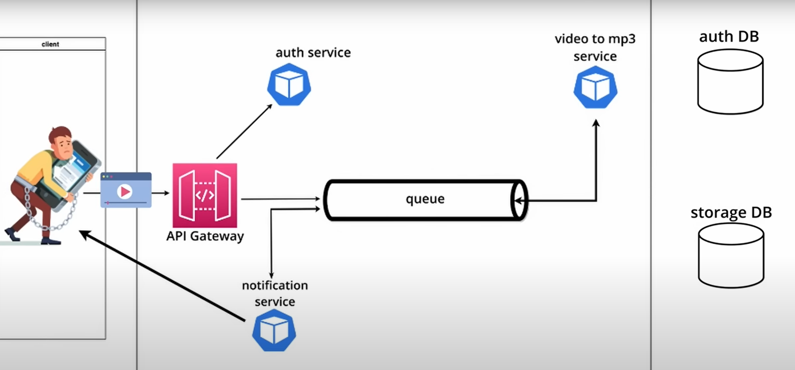

## Microservice Architecture and System Design with Python & Kubernetes
1st recommended
[Microservice Architecture and System Design with Python & Kubernetes – Full Course](https://www.youtube.com/watch?v=hmkF77F9TLw&t=112s)



* for gateway and auth app used fastapi
* used rabbitmq for queue service 
* used postgresql for auth and mongodb for video to mp3 conversion
* ratelimiter added in gateway and auth service 
* gateway -> auth sync communication
* gateway -> converter -> notifier async communication using rabbitmq
* Oauth2 using bearer token used in the auth service
* docker in local system required 

### steps to run the service 
1. start the docker 
2. clone the repo to a local dir 
3. fill the env files
4. run "docker-compose up -d"
5. and look for it in http://localhost:8080

### how to set env files values
```
~~~~~~~~~~~~~~~~~~~~~~~~~~~~~~~~~~~~~~~~~~~~~~~~~~~~~~~~~~~~~~~~~~
auth.env.app
    TITLE=Auth API Oauth2 bearer token based
    VERSION=4.0.1
    HOST=auth-app
    PORT=5000
    SCHEME=http
    DATABASE_HOSTNAME=postgres
    DATABASE_PORT=5432
    DATABASE_PASSWORD=***password of "postgres" service
    DATABASE_NAME=fastapi
    DATABASE_USERNAME=***username of "postgres" service
    SECRET_KEY=***generate from secret library 32 char long 
    ALGORITHM=HS256
    ACCESS_TOKEN_EXPIRE_MINUTES=60
    REFRESH_TOKEN_EXPIRE_HOURS=24
    REDIS_HOST=redis
    REDIS_PORT=6379
~~~~~~~~~~~~~~~~~~~~~~~~~~~~~~~~~~~~~~~~~~~~~~~~~~~~~~~~~~~~~~~~~~
converter.env.app 
    RABBITMQ_HOST=rabbitmq
    RABBITMQ_PORT=5672
    RABBITMQ_USERNAME=***username of "rabbitmq" service
    RABBITMQ_PASSWORD=***password of "rabbitmq" service
    MONGO_USERNAME=***username of "mongo" service
    MONGO_PASSWORD=***password of "mongo" service
    MONGO_HOST=mongo
    MONGO_PORT=27017
~~~~~~~~~~~~~~~~~~~~~~~~~~~~~~~~~~~~~~~~~~~~~~~~~~~~~~~~~~~~~~~~~~
gateway.env.app 
    TITLE=Gateway For Video to Mp3
    VERSION=0.0.1
    MONGO_USERNAME=***username of "mongo" service
    MONGO_PASSWORD=***password of "mongo" service
    MONGO_HOST=mongo
    MONGO_PORT=27017
    RABBITMQ_HOST=rabbitmq
    RABBITMQ_PORT=5672
    RABBITMQ_USERNAME=***username of "rabbitmq" service
    RABBITMQ_PASSWORD=***password of "rabbitmq" service
    AUTH_URI=http://auth-app:5000
    REDIS_HOST=redis
    REDIS_PORT=6379
~~~~~~~~~~~~~~~~~~~~~~~~~~~~~~~~~~~~~~~~~~~~~~~~~~~~~~~~~~~~~~~~~~
notifier.env.app 
    RABBITMQ_HOST=rabbitmq
    RABBITMQ_PORT=5672
    RABBITMQ_USERNAME=***username of "rabbitmq" service
    RABBITMQ_PASSWORD=***password of "rabbitmq" service
    EMAIL_FROM=**registered email id <<go for gmail based>>
    APP_PASSWORD=**app password for this gmail account
~~~~~~~~~~~~~~~~~~~~~~~~~~~~~~~~~~~~~~~~~~~~~~~~~~~~~~~~~~~~~~~~~~
mongo.env.app
    MONGO_INITDB_ROOT_USERNAME=**good username
    MONGO_INITDB_ROOT_PASSWORD=**strong password
~~~~~~~~~~~~~~~~~~~~~~~~~~~~~~~~~~~~~~~~~~~~~~~~~~~~~~~~~~~~~~~~~~
postgres.env.app 
    POSTGRES_USER=**good username
    POSTGRES_PASSWORD=**strong password
    POSTGRES_DB=fastapi
~~~~~~~~~~~~~~~~~~~~~~~~~~~~~~~~~~~~~~~~~~~~~~~~~~~~~~~~~~~~~~~~~~
rabbitmq.env.app 
    RABBITMQ_DEFAULT_USER=**good username
    RABBITMQ_DEFAULT_PASS=**strong password
~~~~~~~~~~~~~~~~~~~~~~~~~~~~~~~~~~~~~~~~~~~~~~~~~~~~~~~~~~~~~~~~~~
redis.env.app
~~~~~~~~~~~~~~~~~~~~~~~~~~~~~~~~~~~~~~~~~~~~~~~~~~~~~~~~~~~~~~~~~~
```